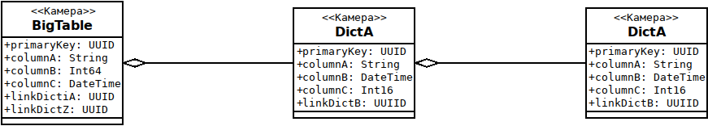

## Цель

Создание ClickHouse DataService (ICSSoft.STORMNET.Business.ClickHouseDataService) в рамках проекта
[Flexberry ORM](https://github.com/Flexberry/NewPlatform.Flexberry.ORM).

## Функциональные требования

DataService должен обеспечивать объектно-реляционное отображение запросов из Microsoft .NET Framework
в SQL-запросы с базе данных ClickHouse.

## Особенности реализации

ClickHouse обеспечивает эффективную работу с "большими" таблицами - сотни миллионов, миллиарды и более записей.
В связи с этим большое внимание необходимо уделить качественному формированию SQL-запроса,
обеспечивающее быстрое и эффективное (с минимальными промежуточными таблицами) выполнение запросов.

Особенности модели данных ClickHouse:

- ClickHouse не поддерживает запросы `UPDATE`, `DELETE`
В связи с этим необходимо реализовать только операции выборки (`SELECT`) данных.

- Как правило, ClickHouse работает с одной "широкой" (возможно денормализованной) таблицей размером сотни миллионов и более записей. ClickHouse - поколоночная база.
Время выполнения запроса прямо пропорционально числу выбираемых столбцов.
В связи с этим необходимо минимизировать число выбираемых столбцов в запросе `SELECT`

- Операции `JOIN` "большой" таблицы, как правило, производятся с небольшими (до миллиона записей) справочными таблицами.
В связи с этим необходимо:

  * В начальном запросе и в подзапросах `JOIN` использовать не сами соединяемые таблицы, а выборки из них 
  `SELECT column, column FROM table ...`
 
  * Минимизировать число выбираемых столбцов в каждом запросе `SELECT`

  * Если условие выборки `WHERE` применется не к столбцам "большой таблицы", а к столбцам присоединяемых справочников,
  то необходимо миниминизовать число соединяемых строк большой таблицы.
  Для этого начальный запрос `SELECT` должен формироваться для "большой" таблицы  и использовать оператор `IN` 
  для выборки записей из большой таблицы  с последующим соединением выбранных записей с требуемыми справочными таблицами.

- В качестве справочных таблиц может быть использованы справочники ClickHouse, представляющие собой синхронизируемые копии справочных таблиц других баз данных (Postgres, MySQ:, MSSQL, Oracle, ...). В этом случае в качестве UUID'ов используются поля типа Int64. Необходимо поддержать возможность использования такого типа ссылочных полей.
  
 ## Формирование запроса SELECT ... JOIN ... к "большой" таблице
 
 Если фраза WHERE применяется **ТОЛЬКО К СТОЛБЦАМ БОЛЬШОЙ ТАБЛИЦЫ**, то необходимо сформировать порядок запросов таким образом, чтобы выборка по условиям из большой таблицы стояла первой
 
Если фраза WHERE применяется **И К СТОЛБЦАМ СПРАВОЧНЫХ ТАБЛИЦ**, необходимо ограничить строки большой таблицы через операцию IN, например:  where ... ссылка_на_справочник1 IN (select ключевой_столбец from справочник1 where ограничения_на_его_столбцы)"
 
 Рассмотрим аггрегацию трех классов:
 
 
Рассмотрим запрос выборки полей таблицы `BigTable`, в которых поле `colimnA` таблицы `dictC` содержит слово 'Perm'.
В результате необходимо вывести поля:
- BigTable.columnA;
- dictA.columnC;
- dictB.columnA;
- dictB.columnB.

Стандартно сформированный запрос выглядит следующим образом:
```
select
 "BigTable"."columnA",
 "dictA"."columnC",
 "dictB"."columnA",
 "dictB"."columnB"
from (
 select
  "BigTable"."columnA",
  "BigTable"."linkDictA"
 from "BigTable"
) as "BigTable"

join (
 select
  "dictA"."primaryKey",
  "dictA"."columnC",
  "dictA"."linkDictB"
 from "dictA"
) as "dictA" ON "BigTable"."linkDictA" = "dictA"."primaryKey"

join (
 select
  "DictB"."primaryKey",
  "DictB"."columnA",
  "DictB"."columnB"
  from "DictB"
) as "DictB" ON "dictA"."linkDictB" = "dictB"."primaryKey"
WHERE "DictB"."columnA" = 'Perm'
```

> Обратите внимание, что в подзапросах вместо полных таблиц  необходимо использовать выборки минимально необходимых столбцов `SELECT` соединяемых таблиц.

Данные запросы в ClickHouse и Postgres выполняются достаточно долго, так как в соединении принимают участи 
**ВСЕ** записи `BigTable`.

Для оптимизации времени выполнения необходимо 
- сначала выбрать оператором `IN` необходимые строки и столбцы `BigTable`
- выбранную подтаблицу соединить со справочниками.

Оптимизированный запрос должен выглядеть так:
```
select
 "BigTable"."columnA",
 "dicktA"."columnC",
 "dictB"."columnA",
 "dictB"."columnB"
from (
 select
  "BigTable"."columnA",
  "BigTable"."linkDictA"
 from "BigTable"

 WHERE "BigTable"."linkDictA" IN (
  SELECT "dictA"."primaryKey"
  FROM (
   SELECT
    "DictB"."primaryKey",
    "DictB"."columnA",
   FROM "DictB" WHERE "DictB"."columnA" = 'Perm'
  ) AS "DictB"
  JOIN {
   SELECT
    "dictA"."primaryKey",
    "dictA"."linkDictB"
  ) AS "dictA" ON "dictA"."linkDictB" = "DictB"."primaryKey"

) as "BigTable"

join (
 select
  "dictA"."primaryKey",
  "dictA"."columnC",
  "dictA"."linkDictB"
 from "dictA"
) as "dictA" ON "BigTable"."linkDictA" = "dictA"."primaryKey"

join (
 select
  "DictB"."primaryKey",
  "DictB"."columnA",
  "DictB"."columnB"
) as "DictB" ON "dictA"."linkDictB" = "dictB"."primaryKey"
```
Операторы подзапроса `IN` выделены большими буквами.
Данные операторы обеспечивают формирование одностолбцовой таблицы, содержащей 
идентификаторы строк таблиц словаря `DictA` по которым необходимо сделать выборку 
строк и столбцов таблицы `BigTable`.

Выбранные строки и столбцы, как и в исходном примере, соединяются с требуемыми строками и столбцами справочников
`DictA`, `DictB`.

## Работа со значениями NULL

ClickHouse поддерживает значения NULL.

Для задания NULL'абельных столбцов  при формировании таблицы вместо оператора `Тип` используется оператор [`Nullable(Тип)`](https://clickhouse.yandex/docs/ru/data_types/nullable/). 

Но при использовании Nullable столбцов:
- увеличивается место занимамое таблицей на диске за счет хранения битовой маски NULL'ов;
- увеличиватся время обработки запросов.

Более оптимальным для ClickHouse является использование default'ных "нулевых" значений для значений типа NULL.
См. раздел [Значения по умолчанию](https://clickhouse.yandex/docs/ru/query_language/create/#create-default-values).

В этом случае при запросах выражения типа:
`имя_столбца!= NULL` нужно будет заменять на выражения типа `имя_столбца!=defailt_value`.

Тип столбца (Nullable или нет) можно определить обратившись к системной таблице `system.columns`

## Предложения по структуре таблиц Clickhouse

В большинстве случаев при обработке больших объемов потоковых (TimeSeries) потоков данных
мы имеем дело с одной большой потоковой таблицей к которой необходимо производить поисковые или аггрегаионные
аналитические запросы. 
Часто для этих запросов необходимо производить операции соединения (JOIN) со справочными таблицами для включения в запрос 
полей справочных таблиц для поиска по ним или агрегации.

Данные операции довольно затратны как по времени выполнения, так и по оперативной памяти.

Так как столбцовые базы данных показывают отличную производительность на "широких" таблицах
предлагается создать "широкую" деномализованную таблицу в которую включить как 
основную потоковую информацию так и поля из справочных таблиц по которым производятся поисковые и агрегационные запросы.

В этом случае основные запросы будет производиться без операции JOIN.

На оcнове данной "широкой" деномализованной таблицы для доступа к разного типа информации (информации от разного типа источников со своим набором полей) можно создать необходимое число представлений (View) к которым и производить  обращение из приложений.


### Широкая Большая таблица

Рассмотрим пример большой денормализованной таблицы `grzevents_BigTable`:

grzevents_BigTable | odisseyevents | ФотофиксацияТС  
-------------------|-----------------|----------------
primarykey | ✗ | primarykey
createtime | ✗ | createtime
creator | typeid | creator
edittime | ✗ | edittime
editor | ✗ | editor
НомерТС | grz | НомерТС
Скорость | speed | Скорость
ОграничениеСкорости | ✗ |  ОграничениеСкорости
ИдентификаторМатериала | ✗ |  ИдентификаторМатериала
Время | datetime | Время
ДатаПоступления| ✗ |  ДатаПоступления
Получатель| ✗ |  Получатель
vehicletype | vehicletype | vehicletype
vehiclecolor | vehiclecolor | vehiclecolor
vehiclebrand | vehiclebrand | vehiclebrand
vehiclemodel | vehiclemodel | vehiclemodel
photo_id | photo_id | ✗
**Источник** | ✗ |  Источник
**Оборудование** | ✗ | ✗
**КомплексОборудования** | ✗ | ✗
*КомплексОборудования_Идентификатор* | object_id |  ✗ 
*Оборудование_Идентификатор* | camera_direction_id |  ✗
*Источник_Идентификатор* | camera_id |  ✗

Информация размещенная в данной таблице доступна в виде двух представлений:
- odisseyevents - представления для системы Сокол-аналитика;
- ФотофиксацияТС - представления для системы Сокол.

Поля выделенные курсивом - деномализованные значения полей соответствующих таблиц (Источник, Оборудования, КомплексОборудования).
(Если в исходной потоковом сообщении основными полями являются поля object_id, camera_direction_id, camera_id денормализованными будут поля выделенные жирным шрифтом).

Формирование значений основных и соответствующих деномализованных полей обеспечивает адаптер обрабатывающий поток данных.

Клиентское приложение может работать с таблицей grzevents_BigTable как напрямую, так и через представления:
```
CREATE VIEW odisseyevents (
  creator AS typeid,
  "НомерТС" AS grz,
  "Скорость" AS speed,
  "Время" AS datetime,
  photo_id AS  photo_id,
  "КомплексОборудования_Идентификатор" AS object_id,
  "Оборудование_Идентификатор" AS camera_direction_id,
  "Источник_Идентификатор" AS camera_id,
  vehicletype Enum16,
  vehiclecolor Enum16,
  vehiclebrand Enum16,
  vehiclemodel Enum16
)
FROM   grzevents_BigTable
```

```
CREATE VIEW "ФотофиксацияТС" (
  primarykey,
  createtime,
  creator,
  edittime,
  editor,
  ОграничениеСкорости,
  НомерТС,
  Скорость,
  ОграничениеСкорости,
  Время,
  ДатаПоступления,
  Получатель,
  Источник,
  vehicletype Enum16,
  vehiclecolor Enum16,
  vehiclebrand Enum16,
  vehiclemodel Enum16
)
FROM   grzevents_BigTable
```

Сервис данных (`DataService`) "зная" структуру денормализованной таблицы должен избегать использование "излишних" соединений.
Например, при запросе значения поля `Идентификатор` справочника Источник `DataService`
не должен производить соединение (`JOIN`) таблиц  `grzevents_BigTable` и Источник 
с последующим выбором значение поля `Источник.Идентификатор`,
а использовать значение поля `Источник_Идентификатор`.


### Импортирование таблиц Postgres как словарей Clickhouse

В состав полей большой деномализованной таблицы не следует включать "справочные" поля - 
строки наименований объектов и т.п.

В этом случае используются справочные таблицы импортированные из базы данных Postgres.
В рамках docker-репозитория `Flexberry` создан образ **[flexberry/clickhouse-official](https://hub.docker.com/r/flexberry/clickhouse-official)**
[поддерживающий данный функционал](https://github.com/Flexberry/dockerfiles/blob/master/clickhouse/official/README-ru.md).
