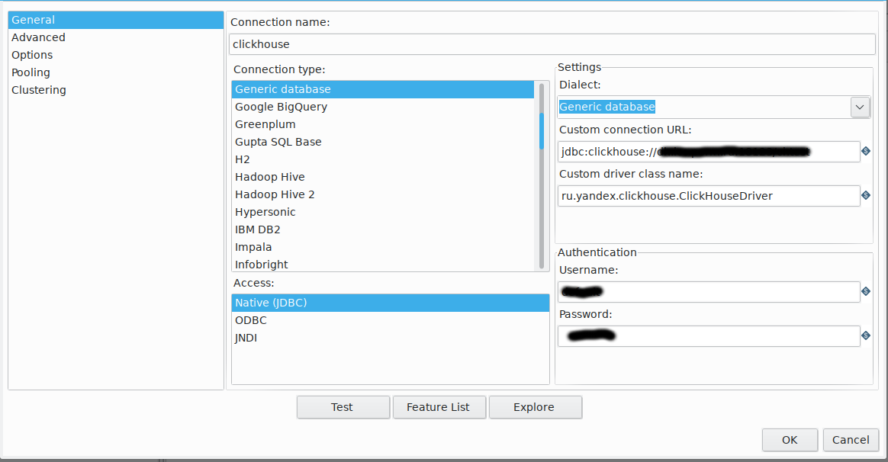
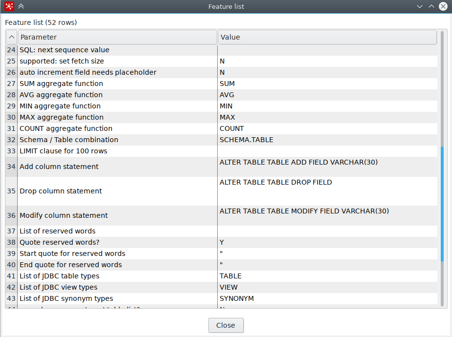
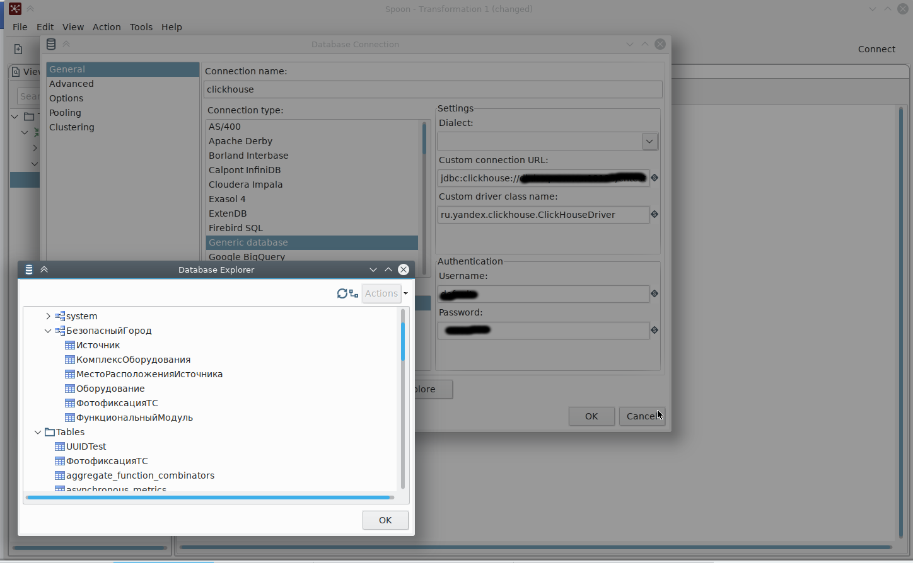

# Использования PDI совместно с ClickHouse

Последнюю версию PDI можно взять на [следующей странице SourceForge](https://sourceforge.net/projects/pentaho/files/Pentaho%208.2/client-tools/).

Интеграция PDI с clickhouse описана на странице [biwed/PDI-clickhouse](https://github.com/biwed/PDI-clickhouse).

Необходимо:
1. Скачать PDI 8.2 и развернуть ZIP-файл

```
$ wget -c https://sourceforge.net/projects/pentaho/files/Pentaho%208.2/client-tools/pdi-ce-8.2.0.0-342.zip
$ unzip pdi-ce-8.2.0.0-342.zip
```

PDI развернется в каталош data-integration.

2. Склонировать интеграционный репозиторий biwed/PDI-clickhouse:

```
$ git clone https://github.com/biwed/PDI-clickhouse
```

3. Скопировать необходимые библиотеки  
```
$ cp PDI-clickhouse/jdbc/* data-integration/lib/
```

4. Запустить Spoon из каталога data-integration

```
$ cd data-integration
$ sh spoon.sh &
```

5. Создать новую трансформацию (File/New/Transformation) или перейти на существующую.

6. Дважды кликнуть на `Database Connections`

В открывшейся вкладке 
- ввести имя соединения (например `clickhouse`);
- Access: `native JDBC`;
- Connection type: `Generic database`;
- Dialect: `Generic database`;
- Custom connectiuon URL: `jdbc:clickhouse:URL_соединения`;
- Custom driver class name: `ru.yandx.clickhouse.ClickHouseDriver`
- Имя и пароль в полях `Username:`, `Password:`



7. Кликните по клавише `Test`. Дожно появиться окно с текстом: `Connection to clickhouse was successful.`

8. Кликните по клавише `Feature List` для просмотра поддерживаемой функционльности драйвера ClikHouse



9. Кликните по клавише `Explore` для просмотра информации по существующим в базе данных
`Schemas`, `Tables`, `Views`, `Synonyms`



Кириллические имена в именах поддерживаются.
